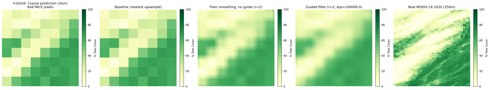
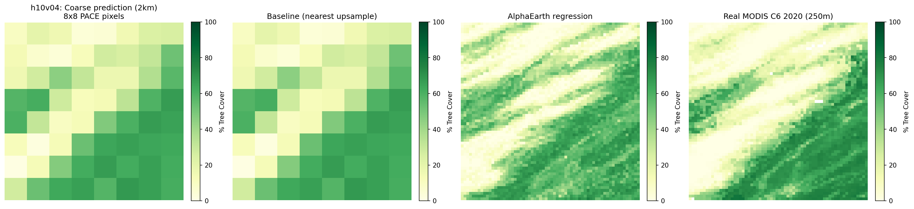

# Super-resolution: downscaling 2 km VCF predictions to 250 m

**Motivation.** This project's trained models predict tree cover at PACE's
native 2 km resolution. MODIS VCF (the reference/target product) is natively
250 m. For a future year with no real MODIS VCF to compare against at all
(e.g. 2026 -- the eventual operational case), a downscaling method calibrated
on years that *do* have real MODIS VCF could turn this project's 2 km
predictions into a MODIS-VCF-*like* 250 m product. Three methods were tried.
**Bottom line: two guide-based texture-injection methods (a guided filter and
residual/ratio injection) do not recover real fine-scale detail and barely
or don't beat naive upsampling; a fine-resolution regression using AlphaEarth
embeddings does recover real detail and generalizes to unseen tiles, and is
the one method worth building on further.**

## Evaluation design

Two different holdout designs were used, because the three methods need
fundamentally different things from their "guide" data.

**Guided filter and residual injection** (notebook `9a`) need real
fine-resolution data at inference time -- the whole point is to borrow
texture from it. To evaluate them without circularity:
- **Region-stratified guide/test tile split.** 46 of 69 available tiles tune
  method hyperparameters ("guide" tiles); 23 are touched only once, for the
  final reported number ("test" tiles). Tiles are stratified into 12 coarse
  regions (latitude band x rough continent, e.g. `Tropical-Americas`) so no
  biome is entirely absent from either set. Two regions were singletons and
  got no guide-tile representation at all.
- **Within-tile checkerboard block holdout.** Individual 2 km blocks
  alternate visible/hidden in a checkerboard pattern within every tile;
  hidden blocks get only the coarse-upsampled value as input (no real fine
  detail), and scoring happens only at hidden locations. This is what makes
  the guide-based methods' evaluation non-circular -- they're never scored on
  a pixel they were shown the real answer for.

**AlphaEarth-embedding regression** (notebook `9b`) needs no same-tile guide
at all -- it's trained once on 46 guide tiles' worth of (fine AlphaEarth
feature, fine MODIS VCF value) pairs, then applied directly to the 23 test
tiles, which it has never seen a single pixel of. This is a **whole-tile
holdout**, not a within-tile checkerboard holdout.

**This difference matters for comparing results across methods** (see
"Important comparability caveat" below) -- the two evaluation designs are
answering different questions, even though they use the same 23 test tiles.

## Method 1: Guided Filter

[He & Sun's Fast Guided Filter](https://arxiv.org/abs/1505.00996): within a
local window, fit a linear model `target ≈ a*guide + b`, then apply that
local `a, b` to the guide to produce the fine output. Two hyperparameters:
window radius, and `eps` (how strongly to regularize the local fit toward a
flat "ignore the guide" answer when the local guide-target correlation is
weak).

**A real bug was found and fixed first** -- see
`knowledge/troubleshooting/box-filter-nan-poisoning.md`. Before the fix,
scattered NoData in the coarse prediction was silently cascading through the
filter's two box-filter passes to poison up to 99%+ of a tile's output as
NaN, and was dropping ~30% of guide tiles from the search entirely (their
`n_valid` count came back 0 for held-out pixels). All numbers below are
post-fix.

**Hyperparameter search** (guide tiles, `radius` in {1,2,3,4,8,16,32},
`eps` in {1, 10, 100, 1000, 10000, 100000}):
- Only `radius <= 4` combinations ever beat the flat baseline; `radius >= 8`
  is worse than doing nothing at every `eps` tested, and gets monotonically
  worse as radius grows.
- Within the winning radii, RMSE improves as `eps` increases, but with
  shrinking returns that fully plateau by `eps=10000` (identical results at
  `eps=100000`) -- i.e. the winning configuration converges toward the
  setting that trusts the guide *least*.
- Best on guide tiles: `radius=2, eps=100000` (tied with `radius=3`).

**Final result on test tiles** (`radius=2, eps=100000`):

| | RMSE | vs. baseline |
| --- | --- | --- |
| Baseline (plain nearest-upsample, no guide) | 9.71% | -- |
| Guided filter | 9.52% | **+0.19 pp** |

A real, but very small, improvement -- and per-tile bias is non-trivial in
several tiles even though aggregate RMSE looks fine (e.g. `h19v08` bias
+5.65%, `h27v07` bias +5.45%).

**Visual check tells the real story.** A plain box-smooth of the coarse
prediction with *no guide involved at all* scores 9.78% on the same test
tiles -- almost identical to the guided filter's 9.52%. Plotted side by side
on a high-contrast crop of `h10v04` (chosen automatically by local-variance
search, landing on a river feature), the guided filter and the no-guide
smoothing are visually indistinguishable, and neither shows any trace of the
real river visible in the actual MODIS reference:

**Conclusion: the guided filter's small win is coming almost entirely from
mild smoothing of the blocky coarse prediction, not from genuine texture
transfer out of the MODIS 2020 guide.** The guide contributes *something* --
0.19-0.26 percentage points better than smoothing alone, consistently, across
radius settings tested -- but not enough to call this real super-resolution.

## Method 2: Residual / Ratio Injection

Two formulations were tried, both extracting the guide's own high-frequency
texture and injecting it onto the coarse-upsampled target, rather than
fitting a local value relationship the way the guided filter does.

- **Additive** (`target + (guide - smooth(guide))`): **worse than baseline
  on every single test tile**, by a lot -- mean RMSE 12.28% vs. 9.71%
  baseline (**-2.57 pp**). Likely cause: no rescaling between the guide's
  local texture amplitude and the target's -- MODIS's real pixel-to-pixel
  swings get added at full, uncalibrated magnitude onto a target with much
  less natural local variance, systematically overshooting.
- **Ratio / SFIM-style** (`target * (guide / smooth(guide))`, denominator
  floored to avoid blowup near 0% cover): better than the additive version
  but still worse than baseline -- mean RMSE 11.13% (**-1.42 pp**).

**Conclusion: neither formulation works, and the failure is informative, not
just negative.** Both assume the guide's local *pattern* of variation
transfers directly to the target; the guided filter's local *linear fit*
(which can shrink toward "ignore the guide" when correlation is weak) is
what keeps it from actively hurting. Blind pattern-injection methods aren't a
good fit for a guide/target pair this loosely correlated (MODIS 2020 vs. a
model's own 2025 prediction).

## Method 3: AlphaEarth-Embedding Regression

Structurally different from the other two: train an XGBoost regressor
directly on (fine 250 m AlphaEarth Foundations embedding, fine 250 m real
MODIS VCF value) pixel pairs from the 46 guide tiles, then apply it to any
tile/year with no guide raster needed at inference at all. This removes the
"guide is from a stale year" problem the other two methods are stuck with.

See `knowledge/datasets/alphaearth-foundations-embeddings.md` for how the
fine-resolution (250 m) embeddings are fetched -- it turns out to need no new
extraction logic beyond notebook `3za`'s already-validated GCS pipeline, just
skipping its final block-reduction step (the intermediate warp grid it
already builds *is* 250 m).

**Result:**

| Metric | Value |
| --- | --- |
| Unweighted mean RMSE across 23 test tiles (as first computed) | 7.36% |
| **Pixel-weighted (pooled) RMSE -- the correct number** | **~8.8-8.9%** |
| Per-tile `correlation_r2` (excluding one degenerate tile) | 0.50 - 0.93 |

The unweighted mean is misleading -- see
`knowledge/troubleshooting/unweighted-vs-pixel-weighted-rmse.md`. Per-tile
sample sizes ranged from 1,054 to ~23 million pixels; a naive average weights
a nearly-empty tile the same as a full one. One tile (`h13v01`, `n=1,054`,
`correlation_r2=0.0000`) is a near-constant-target degenerate case, not a
real result, and should be excluded or down-weighted rather than reported.

Even at the corrected ~8.8-8.9% pooled RMSE, this beats the guided filter's
9.52% and the 9.71% baseline -- a real, if smaller-than-first-appeared,
improvement.

**Important comparability caveat.** This result is not directly comparable
to the guided-filter/smoothing numbers above, even though it's the same 23
test tiles: the guided-filter evaluation is a *within-tile* reconstruction
task (half of one tile's real data used to fill in the other half); this is
a *whole-tile* holdout -- the model never saw a single pixel from any of
these 23 tiles during training. That's arguably a harder and more
operationally relevant test (it matches the real target use case -- a future
year with zero same-tile fine data available at all) but it is a genuinely
different question, and should be described as such rather than implied as
a clean head-to-head.

**Visual check confirms real detail recovery, unlike the other two
methods.** On the identical `h10v04` crop used above, the AlphaEarth
regression panel shows real diagonal texture that tracks the actual river
feature visible in the MODIS reference -- consistent with this tile's strong
`correlation_r2=0.9292`:

One honest characteristic: the AlphaEarth panel is visibly grainier than the
real MODIS data. Each fine pixel is predicted independently from its own
embedding, with no spatial context or smoothness constraint between
neighboring pixels -- unlike a spatially-aware model, which would naturally
produce smoother, more coherent output. A cheap next step, if this is
picked up again, would be a light spatial smoothing pass on the AlphaEarth
prediction itself (not on a guide) to reduce the speckle while keeping the
structure it's already recovering.

## Practical / engineering notes (this method specifically)

- **Memory:** the fine-resolution AlphaEarth fetch is a transient ~5.9 GB
  array per tile (4800x4800x64 bands x 4 bytes). Manageable per-tile, but
  naively accumulating every valid pixel from all 46 guide tiles into one
  training table would reach ~500M+ rows (~135 GB) -- see
  `MAX_PIXELS_PER_TILE=200,000` random per-tile subsampling in notebook `9b`,
  applied only to the *training* accumulation, not to test-tile evaluation
  (which scores every valid pixel per tile for an honest per-tile RMSE).
- **Runtime:** full 46-guide-tile extraction took ~9.5 hours in practice,
  highly uneven per tile (71 seconds to ~25 minutes) depending on how many
  UTM zones a tile spans. This is a background/batch job, not something to
  babysit in a live notebook kernel.
- **Checkpointing was essential, and had to be done carefully** -- see
  `knowledge/troubleshooting/non-atomic-checkpoint-writes.md` for a real bug
  (a crash mid-write left a 0-byte file that a later run then mistook for a
  valid completed checkpoint).
- **GPU training hit two separate, unrelated failures** -- see
  `knowledge/troubleshooting/xgboost-gpu-tree-method-and-arch-mismatch.md`.
  Training fell back to CPU (`tree_method="hist"`, no `device`), which was
  sufficient at this data scale.

## Summary

| Method | Test RMSE | vs. baseline | Recovers real detail? |
| --- | --- | --- | --- |
| Baseline (plain nearest-upsample) | 9.71% | -- | No (by definition) |
| Plain smoothing, no guide (r=2) | 9.78% | -0.07 pp | No |
| Guided filter (r=2, eps=100000) | 9.52% | +0.19 pp | No -- visually indistinguishable from smoothing |
| Residual injection, additive | 12.28% | -2.57 pp | No |
| Residual injection, ratio/SFIM | 11.13% | -1.42 pp | No |
| AlphaEarth-embedding regression (pooled) | ~8.8-8.9% | ~+0.8-0.9 pp | **Yes** -- visually confirmed, different evaluation design (see caveat) |

**Recommendation if this resumes:** drop the guide-based texture-injection
methods (guided filter and residual injection both plateau at "barely better
than smoothing" or worse, and neither method's failure mode looks fixable by
further hyperparameter search). Build on the AlphaEarth-regression approach
instead -- it's the only one of the three that doesn't depend on a stale
guide and the only one with visually-confirmed real detail recovery. Next
concrete steps: a light spatial-smoothing pass to address the speckle noted
above, and re-running the guided-filter-style checkerboard evaluation
*within* held-out tiles too (not just the whole-tile holdout) so the
AlphaEarth result can be reported on a design that's directly comparable to
the other two methods, not just alongside them.
